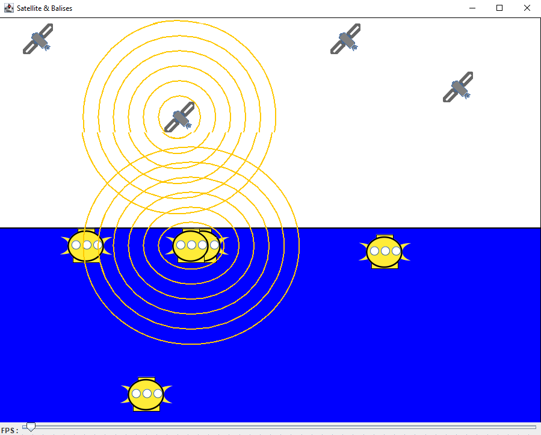
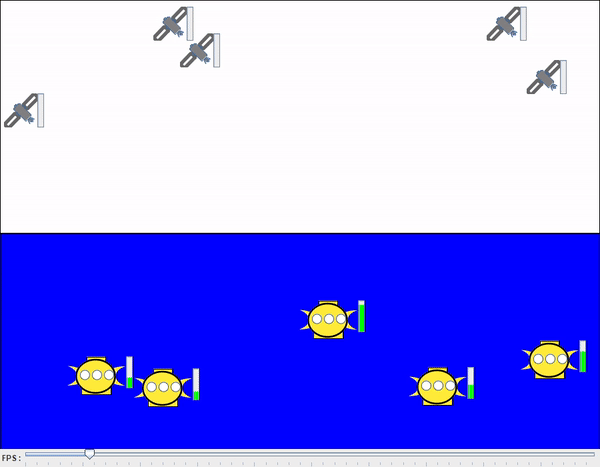
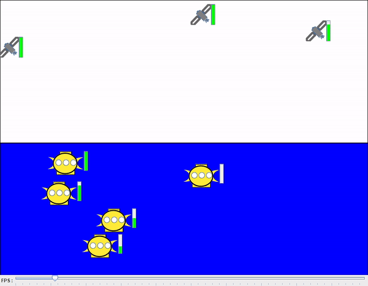

# Auteurs : Nedelec Romain // Stoliaroff Clément // Tassy Quentin

# Projet balises-satellites
Le projet balises-satellites simule le fonctionnement de balises sous-marines collectant des données.

# Modifications apportés :
## Correction du bug : 

**Erreur :**

- Une balise vidait ses "datasizes" avant même d'avoir effectué une synchronisation complète avec un satellite.

**Résolution :**

- Mise en place d'un flag "collecte" désignant l'action de collecter des données. Si la collecte est en cours, alors le "datasize" s'incrémente.

- Au moment ou la balise est pleine et en collecte, alors la balise se place en synchronisation et arrête sa collecte. 

- Une fois la synchronisation avec le satellite effectué, la balise se vide.

## Ajout de jauges de données (Satellites / Balises) :

- Création d'un composant NiProgressBar représentant une barre de chargement.

- Ajout d'un attribut dataBar à la classe GrElementMobile.

- Ajout d'une méthode setUpDataBar dans la classe GrElementMobile permettant de mettre en place la barre de chargement des données à côté des balises et sattelites.

- Appel de la méthode setUpDataBar dans la méthode setModel de la classe GrElementMobile.

- Ajout d'une méthode updateDataBar dans la classe GrElementMobile, qui permet de faire charger la barre de chargement des données.

- Appel de la méthode updateDataBar dans les méthodes whenStartSynchro, whenStopSynchro et whenPositionChanged de la classe GrElementMobile.

## Transmission des données aux satellites :
Une fois que la mémoire de la balise est pleine, celle-ci remonte à la surface et se prépare à transmettre ses données. Lorsque la balise est à la surface, sa "datasize" est additionner à celle du satellite.

Si tout les satellites ont leurs "memorysize" pleine alors les balises remontent à la surface et attendent un nouveau satellite vide. 

### Améliorations possible :
- L'implémentation d'un élément qui viendrais récupérer les balises
- Un satellite plein transfert ses données vers une station marine
