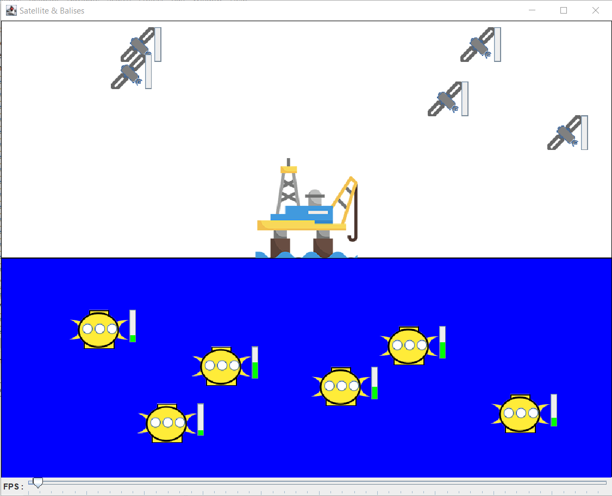

# Auteurs : Nedelec Romain // Stoliaroff Clément // Tassy Quentin

# Projet balises-satellites
Le projet balises-satellites simule le fonctionnement de balises sous-marines collectant des données.

# Modifications apportés :
## Correction du bug : 

**Erreur :**

- Une balise vidait ses "datasizes" avant même d'avoir effectué une synchronisation complète avec un satellite.

**Résolution :**

- Mise en place d'un flag "collecte" désignant l'action de collecter des données. Si la collecte est en cours, alors le "datasize" s'incrémente.

- Au moment ou la balise est pleine et en collecte, alors la balise se place en synchronisation et arrête sa collecte. 

- Une fois la synchronisation avec le satellite effectué, la balise se vide.

## Ajout du déplacement en diagonale :
Ajout d'un déplacement en diagonale entre deux point défini.

**Erreur :**
La balise ne va pas d'un point n°1 (x,y) au point n°2 (x,y) mais du P1.x vers le P2.x en descendant / montant en diagonale, ce fonctionnement implique que la balise ne se rends pas précisement au point demandé.

## Ajout de jauges de données (Satellites / Balises) :

- Création d'un composant NiProgressBar dans le package Nicellipse représentant une barre de chargement.

- Ajout d'un attribut dataBar à la classe GrMovableElement.

- Ajout d'une méthode setUpDataBar dans la classe GrMovableElement permettant de mettre en place la barre de chargement des données à côté des balises et sattelites.

- Appel de la méthode setUpDataBar dans la méthode setModel de la classe GrMovableElement.

- Ajout d'une méthode updateDataBar dans la classe GrMovableElement, qui permet de faire charger la barre de chargement des données.

- Appel de la méthode updateDataBar dans les méthodes whenStartSynchro, whenStopSynchro et whenPositionChanged de la classe GrMovableElement.

## Transmission des données aux satellites :
Une fois que la mémoire de la balise est pleine, celle-ci remonte à la surface et se prépare à transmettre ses données. Lorsque la balise est à la surface, sa "datasize" est additionner à celle du satellite.

Si tout les satellites ont leurs "memorysize" pleine alors les balises remontent à la surface et attendent un nouveau satellite vide. 

## Refactorisation du code :

Dans le but d'ajouter des éléments immobiles, tel qu'une station marine, le code a été refactorisé.

- Ajout d'une classe abstraite Model.

- la classe MovableElement est désormais abstraite.

- Déplacement de plusieurs attributs et méthodes de la classe MovableElement dans la classe Model.

- La classe MovableElement étends la classe Model.

- Dans la classe Manager, les listes de balises et de satellites on été remplacées par une liste de Model.

- Dans la classe Manager, remplacement des méthodes addBalise et addSatellite par une méthode addModel.

- Dans la classe Manager, les méthodes baliseReadyForSynchro et baliseSynchroDone ont été adaptées pour parcourir la nouvelle liste de Model.

- Création d'une classe abstraite UnmovableElement.

- Création d'une classe abstraite GrModel.

- La classe GrMovableElement désormais abstraite et étend la classe GrMovableElement.

- Déplacement d'attributs et de méthodes de la classe GrMovableElement dans la classe GrModel.

- Création d'une classe abstraite GrUnmovableElement.

## Mise en place d'une station maritime

Une Station maritime a été ajoutée.

- Ajout d'une image représentant la station maritime.

- Ajout d'une classe MaritimeStation.

- Ajout d'une classe GrMaritimeStation.

- Ajout d'une méthode addMaritimeStation dans la classe Simulation.

- Appel de la méthode addMaritimeStation dans la méthode launch de la classe Simulation.

## Mise en forme du code :
- Traduction du code écrit en français vers de l'anglais
- Documentation de classe Simulation, les classes de la vue, les events... (javadoc)

### Améliorations possible :
- L'implémentation d'un élément qui viendrais récupérer les balises
- Un satellite plein transfert ses données vers la station marine
